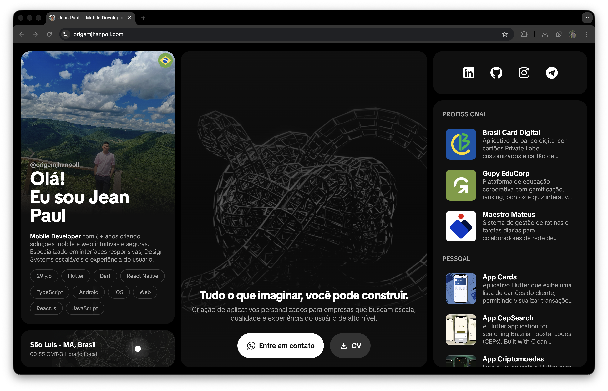

# Portfólio - Jean Paul

Este projeto é o portfólio pessoal e profissional de Jean Paul. O objetivo deste site é apresentar minhas habilidades, experiência, projetos e contatos de forma interativa, moderna e responsiva. O conteúdo é dinâmico e alimentado por arquivos JSON, permitindo fácil manutenção e atualização das informações.



## Tecnologias Utilizadas

Este projeto foi construído utilizando as seguintes tecnologias modernas de desenvolvimento web:

-   **React**: Biblioteca para construção de interfaces de usuário (v19).
-   **React Router v7**: Framework para roteamento e renderização (SSR/SPA).
-   **TypeScript**: Superconjunto de JavaScript que adiciona tipagem estática.
-   **Tailwind CSS (v4)**: Framework de CSS utilitário para estilização rápida e responsiva.
-   **Vite**: Ferramenta de build e desenvolvimento ultra-rápida.

## Estrutura do Projeto

O código fonte principal reside dentro da pasta `app`. Abaixo está uma descrição detalhada da estrutura e o propósito de cada diretório e arquivo principal:

### 📂 `app`

Abaixo está a estrutura de diretórios e arquivos principais do projeto:

```
app/
├── assets/                 # Recursos estáticos
│   ├── image/              # Imagens do projeto
│   └── json/               # Dados do conteúdo (pt, en, cn)
├── components/             # Componentes de UI
│   ├── shared/             # Componentes reutilizáveis
│   ├── actions.tsx         # Lógica de ações do usuário
│   ├── details.tsx         # Detalhes do projeto
│   ├── local.tsx           # Componente de horário local
│   ├── main.tsx            # Banner principal
│   ├── profile.tsx         # Seção de perfil
│   ├── projects.tsx        # Lista de projetos
│   └── social.tsx          # Links de redes sociais
├── routes/                 # Rotas da aplicação
│   └── _index.tsx          # Rota principal (Home)
├── services/               # Lógica de dados
│   ├── main_service.ts
│   ├── profile_service.ts
│   ├── projects_service.ts
│   └── social_service.ts
└── root.tsx                # Componente raiz da aplicação
```

#### Detalhes dos Diretórios

-   **`📂 components`**: Este é o coração da interface do usuário. Aqui residem todos os elementos visuais da aplicação.
    -   **Principais**: `main.tsx` (Banner de vídeo introdutório), `profile.tsx` (Apresentação pessoal e profissional), `projects.tsx` (Galeria de projetos e portfólio).
    -   **Funcionais**: `actions.tsx` (Lógica de interatividade), `local.tsx` (Widget de fuso horário), `social.tsx` (Links externos).
    -   **Estruturais**: `root.tsx` define o layout base da aplicação.

-   **`📂 services`**: Atua como uma camada de API simulada ou "Data Access Object" (DAO).
    -   Sua função é desacoplar a interface dos dados brutos. Os arquivos aqui (`projects_service.ts`, `profile_service.ts`, etc.) são responsáveis por ler, filtrar e formatar as informações do JSON antes de entregá-las aos componentes. Isso facilita testes e futuras integrações com uma API real.

-   **`📂 assets`**: Repositório de recursos estáticos e dinâmicos.
    -   **`json/`**: Contém a "alma" do conteúdo. O arquivo `data.json` permite gerenciar textos, projetos, links e configurações sem necessidade de recompilação do código. Suporta internacionalização (pt, en, cn).
    -   **`image/`**: Armazena ativos visuais otimizados.

-   **`📂 routes`**: Configuração de roteamento baseada em arquivos (File-System Routing) do React Router v7.
    -   `_index.tsx`: É o ponto de entrada da rota principal, orquestrando a montagem dos componentes na página inicial.

---

Este projeto é mantido por [Jean Paul](https://github.com/origemjhanpoll).
