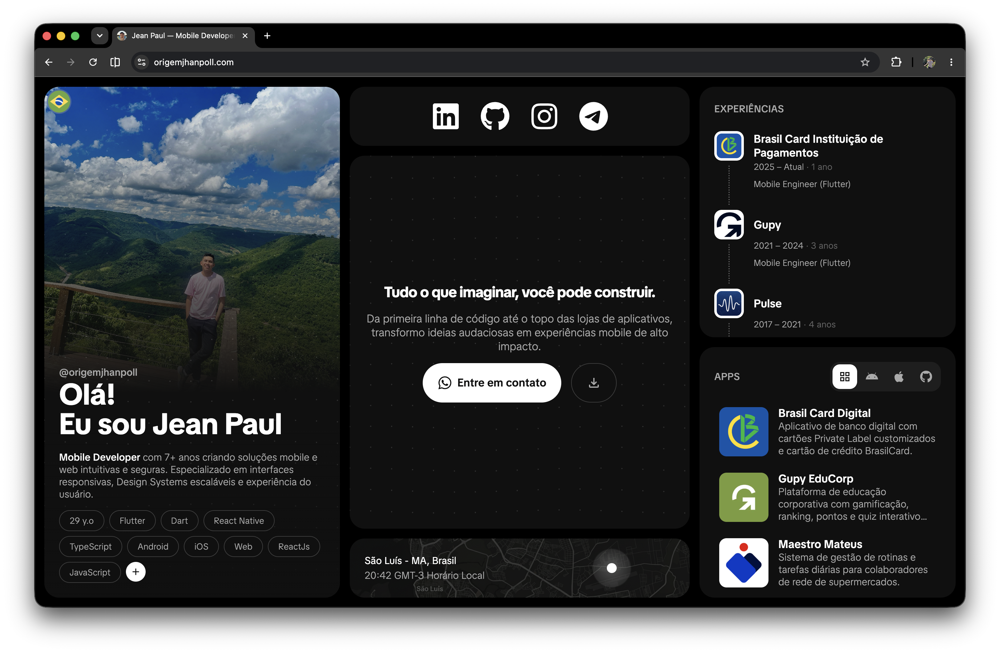

# Portfólio - Jean Paul

Este projeto é o portfólio pessoal e profissional de Jean Paul. O objetivo deste site é apresentar minhas habilidades, experiência, projetos e contatos de forma interativa, moderna e responsiva. O conteúdo é dinâmico e alimentado por arquivos JSON, permitindo fácil manutenção e atualização das informações.



## Tecnologias Utilizadas

Este projeto foi construído utilizando as seguintes tecnologias modernas de desenvolvimento web:

-   **React**: Biblioteca para construção de interfaces de usuário (v19).
-   **React Router v7**: Framework para roteamento e renderização (SSR/SPA).
-   **TypeScript**: Superconjunto de JavaScript que adiciona tipagem estática.
-   **Tailwind CSS (v4)**: Framework de CSS utilitário para estilização rápida e responsiva (com o plugin `@tailwindcss/typography`).
-   **Vite**: Ferramenta de build e desenvolvimento ultra-rápida.
-   **react-icons**: Conjunto de ícones (Material Design, Font Awesome, etc.).
-   **react-markdown** + **rehype-raw**: Renderização do conteúdo Markdown dos detalhes dos projetos.

## Como Rodar

```bash
npm install      # instala as dependências
npm run dev      # ambiente de desenvolvimento (HMR)
npm run build    # build de produção
npm run start    # serve o build de produção
npm run typecheck # geração de tipos das rotas + checagem do TypeScript
```

## Estrutura do Projeto

O código fonte principal reside dentro da pasta `app`. Abaixo está uma descrição detalhada da estrutura e o propósito de cada diretório e arquivo principal:

### 📂 `app`

```
app/
├── assets/                      # Recursos estáticos
│   ├── image/                   # Imagens (perfil, screenshot)
│   ├── json/                    # Conteúdo i18n — data.json por idioma (pt, en, cn)
│   ├── png/                     # Bandeiras dos idiomas (br, us, cn)
│   └── svg/                     # Badges (App Store, Play Store)
├── components/                  # Componentes de UI
│   ├── shared/                  # Componentes reutilizáveis
│   │   ├── button.tsx           # Botão com variantes
│   │   └── markdown-viewer.tsx  # Renderiza o Markdown dos detalhes
│   ├── actions.tsx              # Lógica de ações do usuário
│   ├── details.tsx              # Conteúdo dos detalhes do projeto
│   ├── experience.tsx           # Seção de experiência profissional
│   ├── geometric-background.tsx # Fundo animado interativo (canvas)
│   ├── local.tsx                # Widget de horário local
│   ├── main.tsx                 # Seção principal (hero)
│   ├── profile.tsx              # Perfil pessoal e skills
│   ├── projects.tsx             # Galeria de projetos
│   ├── projects-filter.tsx      # Filtro por categoria (Android / iOS / GitHub)
│   ├── social.tsx               # Links de redes sociais
│   └── index.ts                 # Barrel export dos componentes
├── hooks/
│   └── use_og_image.ts          # Hook para buscar a imagem Open Graph de repositórios
├── routes/                      # Componentes de rota
│   ├── home.tsx                 # Página inicial
│   ├── home.css                 # Estilos da home
│   └── project.tsx              # Detalhes do projeto (/projects/:slug)
├── services/                    # Camada de acesso a dados (lê e formata os JSON)
│   ├── experience_service.ts
│   ├── main_service.ts
│   ├── profile_service.ts
│   ├── projects_service.ts      # inclui getProjectBySlug
│   ├── social_service.ts
│   └── index.ts                 # Barrel export dos services
├── utils/
│   └── slugify.ts               # Gera slugs de URL a partir de títulos
├── app.css                      # Estilos globais (Tailwind)
├── routes.ts                    # Configuração de rotas (React Router v7)
└── root.tsx                     # Layout raiz da aplicação
```

#### Detalhes dos Diretórios

-   **`📂 components`**: É o coração da interface do usuário. Aqui residem todos os elementos visuais da aplicação.
    -   **Principais**: `main.tsx` (seção de abertura/hero), `profile.tsx` (apresentação pessoal e skills), `experience.tsx` (histórico profissional), `projects.tsx` (galeria de projetos e portfólio).
    -   **Funcionais**: `actions.tsx` (interatividade), `local.tsx` (widget de fuso horário), `social.tsx` (links externos), `projects-filter.tsx` (filtro de projetos por categoria), `geometric-background.tsx` (fundo animado em canvas que reage ao mouse).
    -   **Reutilizáveis (`shared/`)**: `button.tsx` (botão com variantes) e `markdown-viewer.tsx` (renderização de Markdown).

-   **`📂 services`**: Atua como uma camada de API simulada ou "Data Access Object" (DAO).
    -   Sua função é desacoplar a interface dos dados brutos. Os arquivos aqui (`projects_service.ts`, `profile_service.ts`, `experience_service.ts`, etc.) são responsáveis por ler, filtrar e formatar as informações do JSON antes de entregá-las aos componentes. Isso facilita testes e futuras integrações com uma API real.

-   **`📂 assets`**: Repositório de recursos estáticos e dinâmicos.
    -   **`json/`**: Contém a "alma" do conteúdo. O arquivo `data.json` (um por idioma) permite gerenciar textos, projetos, links e configurações sem necessidade de recompilação do código. Suporta internacionalização (pt, en, cn).
    -   **`image/`**, **`png/`** e **`svg/`**: Armazenam ativos visuais — imagens, bandeiras dos idiomas e badges das lojas de aplicativos.

-   **`📂 routes`**: Componentes de cada rota da aplicação.
    -   `home.tsx`: ponto de entrada da rota principal, orquestrando a montagem dos componentes na página inicial.
    -   `project.tsx`: página de detalhes de um projeto, acessada por `projects/:slug`.
    -   O mapeamento das rotas é declarado explicitamente em `app/routes.ts` (configuração do React Router v7).

-   **`📂 hooks`** e **`📂 utils`**: Lógica reutilizável — hooks customizados (ex.: `use_og_image.ts`) e funções utilitárias (ex.: `slugify.ts`, usado para gerar as URLs amigáveis dos projetos).

---

Este projeto é mantido por [Jean Paul](https://github.com/origemjhanpoll).
